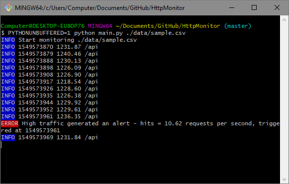
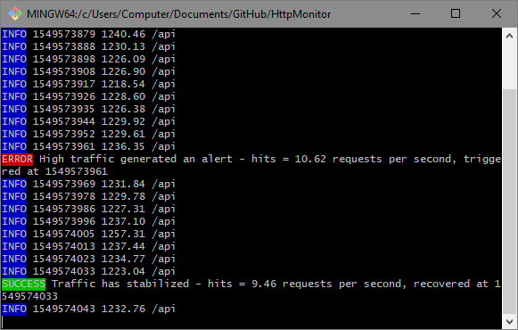

# HttpMonitor

Console program that tails a csv-encoded HTTP access log.
- Prints out summary statistics every 10 seconds.
- An alert message is printed when average traffic in the last two minutes exceeds a threshold.
- A message is printed when traffic drops below the threshold.




## Setup

1. Create a virtual environment and activate it.
2. Install dependencies.
    ```bash
    pip install -r requirements.txt
    ```

## Linting

This repository follows pep8 with the exception max line length.

```bash
pycodestyle . --max-line-length=120
```

## Testing

```bash
python -m unittest tests.py
```

## Usage

Run the program from the terminal.

```bash
PYTHONUNBUFFERED=1 python main.py path/to/file.csv
```

### Options
- `-t` `--threshold` - Requests per second considered to be high traffic.
- `-i` `--log_interval` - Number of seconds to collect logs before printing a summary.
- `-w` `--log_window` - Number of seconds to look back when checking for high traffic.

## Known Bugs

1. When the end of the file has been reached it does not print a summary of any logs that it might have read before hitting the end of the file.
2. When using a Windows machine the colors might not print properly.

## Next steps

1. Add better error handling. Currently the program expects the information in the csv to be formatted like the sample csv and will raise an exception if the input deviates.
2. Real log files are continuously growing. This program needs to be updated to wait for more logs to be written when it reaches the end of the log file.
3. Add more unit tests.
4. In a production scenario, the monitor would be started in the background and the results would only be checked occasionally indirectly.
    - Instead of printing to the terminal, it should print to a more permanent store so a web interface can display the information.
    - Graph of the number of requests per second over time.
    - A count of the number of 500 errors.

### Scaling

1. This program needs to be able to monitor multiple logs from multiple servers.
2. For production logging, occasionally the log files get rotated. This program needs a way to detect this and open the new file.
